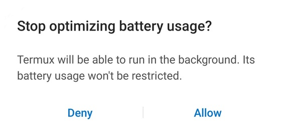

# mysql-for-termux
**An easy way for students to install and run a MySQL server on their Android device.**  
  
Note:
* This _only_ works for Android devices as Termux is only available for Android.
* This is _only_ meant for learning purposes and must **not** be used for commercial purposes.

## Instructions
1. Install the Termux app from Google Play [here](https://play.google.com/store/apps/details?id=com.termux).
2. Open the application, copy-paste the command given under the next heading and press enter on your Android device.  
Now the installation will begin. Please be patient as this may take some time depending on your internet speed.  
You will be asked to answer `Do you want to continue? [Y/n]` upto three times. Each time type in 'y' and press enter.  
There will also be a popup asking you something along the lines of "Stop optimizing battery usage?" similar to the one shown below. Press 'allow' or equivalent.  
</img>  
Do not worry, this app does not consume much battery at all.
3. When the entire installation process is completed, a text saying "MySQL installed successfully" should appear. Now, the MySQL server has started on your machine. Enter the command `setpass` and set a password (for the user _root_). This can _only_ be done while the server is running.
4. Enter the command `start-client` to start the MySQL client or close the Termux application. The MySQL server will keep running in the background allowing you to use Python libraries like PyMySQL to connect to your databases through an app like Pydroid (avaialable on Google Play [here](https://play.google.com/store/apps/details/Pydroid_3_IDE_for_Python_3?id=ru.iiec.pydroid3)), which is a Python editor and compiler for Android.

#### Note:
You can also go to Settings and turn off notifications for Termux if you find its permanent notification bothersome.

## Command
This is the command to be entered in step 2:

```shell
apt update && apt upgrade; pkg install wget; cd ..; wget -O mysql.tar.gz "https://github.com/TheLastAirbendr/mysql-for-termux/archive/v2.0.2.tar.gz"; tar -xzf mysql.tar.gz -C home --strip-components 1 && rm mysql.tar.gz && cd home && rm -r images && rm README.md; chmod u+x installer.sh; ./installer.sh; source ~/../usr/etc/bash.bashrc; rm installer.sh
```

## Troubleshooting Errors
1. If you get any errors during or after installation, type into the Termux terminal (after the '$' symbol): `cat logs.log` and submit a screenshot of the output.
2. If you get the following error when you enter `setpass` or `start-client` into the terminal:  
  
   ```
   Error 2002 (HY000): Can't connect to local MySQL server through the socket '/data/data/com.termux/files/usr/tmp/mysqld.sock' (111)
   ```  
   Type into the terminal the command `start-server` to start the MySQL server. You should get the output: "MySQL server started". Now try using `setpass` / `start-client` again and everything should work normally.  
   If you are still getting errors anyway, then run the command `cat logs.log` and submit a screenshot of the output.
